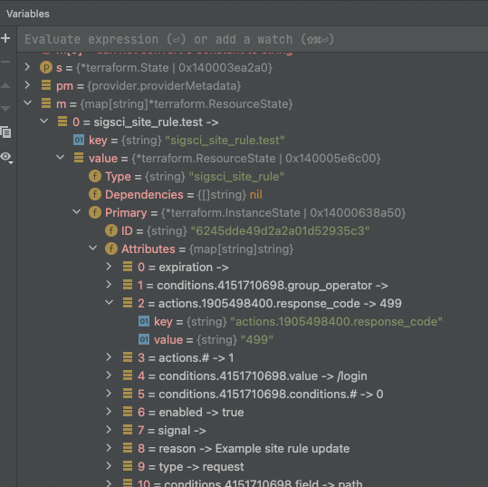

# Testing instructions for provider

### Pre-requisites

1. Setup a new Corporation in SignalSciences dashboard or use an existing one.
2. Create an API token to programmatically access the corp resources. Log in with a user with access to the corp and visit: https://dashboard.signalsciences.net/corps/<corp_name>/user/apitoken

### Running tests

1. In a new terminal, export the following variables used in tests:
    
    ```bash
    export SIGSCI_EMAIL="<login_email>"
    export SIGSCI_CORP="<corp_name>"
    export SIGSCI_TOKEN="<api_token>"
    export TF_ACC=1 # enables acceptance tests in code
    ```
    
2. You can now run all the tests by running `make testacc` from root of the repository.

### Debugging

- If tests fail intermittently, you can disable parallel test execution by passing `-p 1` to the test command. Example:  `go test -p 1 -v ./...`
- Functions in tests perform testing against the terraform state in memory. Take the following code in [TestACCResourceSiteRule_basic](https://github.com/signalsciences/terraform-provider-sigsci/blob/d270ca7efdfa3796639b9d43f453247cdf6f2323/provider/resource_site_rule_test.go#L15) for example:
    
    ```go
    resource "sigsci_site_rule" "test"{
      site_short_name="%s"
      type= "signal"
      group_operator="any"
      enabled= true
      reason= "Example site rule update"
      signal= "SQLI"
      expiration= ""
      conditions {
        type="single"
        field="ip"
        operator="equals"
        value="1.2.3.4"
      }
      conditions {
        type="single"
        field="ip"
        operator="equals"
        value="1.2.3.5"
      }
      actions {
        type="excludeSignal"
      }
    }
    ```
    
    The acceptance test creates a `sigsci_site_rule` which runs the code within [resource_site_rule.go](https://github.com/signalsciences/terraform-provider-sigsci/blob/d270ca7efdfa3796639b9d43f453247cdf6f2323/provider/resource_site_rule.go#L11). The terraform gets run and and the site rule gets added to the terraform state in memory under a reproducible hash. The state is then checked to validate that the rule attributes such as actions and conditions were added properly. See the following [example](https://github.com/signalsciences/terraform-provider-sigsci/blob/d270ca7efdfa3796639b9d43f453247cdf6f2323/provider/resource_site_rule_test.go#L56)
    
    ```go
    resource.TestCheckResourceAttr(resourceName, "actions.#", "1"),
    resource.TestCheckResourceAttr(resourceName, "actions.2526394097.type", "excludeSignal"),
    resource.TestCheckResourceAttr(resourceName, "conditions.#", "2"),
    resource.TestCheckResourceAttr(resourceName, "conditions.2534374319.field", "ip"),
    resource.TestCheckResourceAttr(resourceName, "conditions.2534374319.group_operator", ""),
    resource.TestCheckResourceAttr(resourceName, "conditions.2534374319.operator", "equals"),
    ```
    
    `2526394097` and `2534374319` values are hashes automatically generated by Terraform and need to be changed every time the code for that specific resource changes. The hash in tests need to be updated after updating the code. There is a `testInspect()` function in `lib_test.go` and you can put a breakpoint on [return of the function](https://github.com/signalsciences/terraform-provider-sigsci/blob/d270ca7efdfa3796639b9d43f453247cdf6f2323/provider/lib_test.go#L123) and inspect the terraform state and copy the hash to update in test.
    
    
